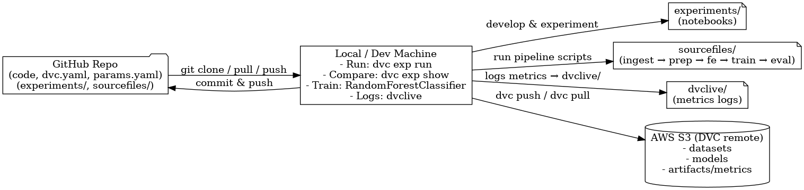

## MLOps ML Pipeline with DVC
A complete MLOps pipeline using **DVC, MLflow (via DVCLive), and AWS S3** for experiment tracking, model versioning, and reproducibility.

## Project Structure
```
├── experiments/       # Jupyter notebooks for ML algorithm experimentation
├── sourcefiles/       # Modular pipeline scripts (ingestion → evaluation)
├── dvclive/           # Auto-generated experiment logs from DVC Live
├── dvc.yaml           # DVC pipeline stages definition
├── params.yaml        # Tunable experiment parameters
├── README.md          # Project documentation
```

## Pipeline Overview
1. **Experimented multiple ML models** in notebook → selected `RandomForestClassifier`
2. Built reproducible pipeline for:
   - Data ingestion
   - Preprocessing
   - Feature engineering
   - Model training & evaluation
3. Tracked experiments using:
   - `dvc exp run`
   - `dvc exp show` (to compare parameters & metrics)
   - `dvclive` for ML metrics logging
4. Used **AWS S3** as remote storage for:
   - Dataset
   - Model artifacts
   - DVC experiment tracking

## Key Commands
```sh
dvc pull                     # Fetch data from S3
dvc exp run                  # Run experiment
dvc exp show                 # Compare experiments
dvc push                     # Push data/model to S3
```
## Architecture
